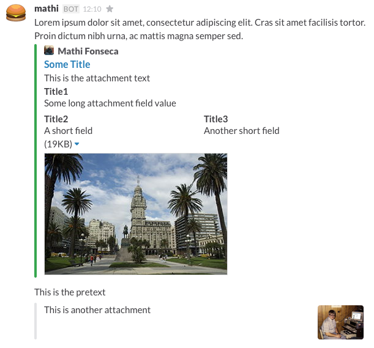

#Grails Plugin for Slack integration using Webhooks

[](https://travis-ci.org/mathifonseca/grails-slack)

This plugin lets you send messages your Slack users or channels from a Grails application.

##Installation

Add the plugin to your `BuildConfig.groovy` using the last version specified in the [Grails Plugins Portal](http://grails.org/plugin/slack).

It should look like this:

```groovy
compile ":slack:1.0.0"
```

##Configuration

Before using the plugin, you need to create an Incoming Webhook in your Slack account. In summary, they are REST endpoints that you can send HTTP requests with a JSON payload containing the message data.

Here is the documentation provided by Slack API page: https://api.slack.com/incoming-webhooks

It will ask you to select a channel where it will post messages to. But don't worry, you can change that for each message you send later.

After you've created the webhook, add this configuration to your `Config.groovy` (in your application):

```groovy
slack {
    webhook = 'https://hooks.slack.com/services/XXXXXXXXX/XXXXXXXXX/XXXXXXXXXXXXXXXXXXXXXXXX'
}
```

##Documentation

###Slack API

The idea behind the plugin is to create an easy to use and very straight forward DSL for the payload you need to send to the webhook. Basically, it's an adaptation of the Slack API documentation for message formatting and attachments. If you want to read about it and see more examples (and maybe make changes to the plugin), you can read the links that the plugin is based on:

- https://api.slack.com/docs/formatting
- https://api.slack.com/docs/attachments
- https://api.slack.com/docs/unfurling

Please pay special attention to the URLs and Escaping section of the Formatting documentation, because the plugin can help you with the message structure but not with its content formatting.

###Plugin DSL

Your DSL will create an instance of the class [`SlackMessage`](src/groovy/grails/plugin/slack/SlackMessage.groovy), which will be encoded as JSON and posted to the Slack webhook. That class has a list of attachments, which are based on the class [`SlackMessageAttachment`](src/groovy/grails/plugin/slack/SlackMessageAttachment.groovy). And again, attachments have fields, which are based on the class [`SlackMessageAttachmentField`](src/groovy/grails/plugin/slack/SlackMessageAttachmentField.groovy). Check those classes to learn about the constraints for their fields.

Some of the parameters you can send in the payload have a default value set in the plugin, as a kind of convention. Of course, if you don't like it, you can specify your own value in your message DSL. Here are the default values (check the links above to know what they mean):

| argument | value |
|---|---|
| mrkdwn | true |
| link_names | 1 |
| parse | full |
| unfurl_links | true |
| unfurl_media | true |
| short | false |

##Usage

The plugin provides a service called [`SlackService`](grails-app/services/grails/plugin/slack/SlackService.groovy) (that was unexpected, right?). You can inject it in your services or controllers and use it's `send()` method to send your messages. This message receives a closure with the DSL you need to create your message.

Here is an example that uses **everything** available for you. Most of the fields are optional or have default values, so this is kind of an exaggerated use case. Remember to check the constraints in the plugin classes and the documentation in Slack API to know what do each of these things mean and how they will look in your Slack client.

```groovy
slackService.send {
    text 'Lorem ipsum dolor sit amet, consectetur adipiscing elit. Cras sit amet facilisis tortor. Proin dictum nibh urna, ac mattis magna semper sed.'
    username 'mathi'
    iconUrl 'https://s3.amazonaws.com/uifaces/faces/twitter/BillSKenney/128.jpg'
    iconEmoji ':hamburger:'
    channel '@mathi'
    markdown true
    linkNames 1
    parse 'full'
    unfurlLinks false
    unfurlMedia false
    attachment {
        fallback 'This is the fallback'
        color 'good'
        authorName 'Mathi Fonseca'
        authorLink 'https://github.com/mathifonseca'
        authorIcon 'https://avatars2.githubusercontent.com/u/4367808?v=3&s=460'
        title 'Some Title'
        titleLink 'http://example.com/title'
        text 'This is the attachment text'
        imageUrl 'http://wikitravel.org/upload/shared//thumb/f/fc/Montevideo.jpg/300px-Montevideo.jpg'
        markdownIn(['text','fields'])
        field {
            title 'Title1'
            value 'Some long attachment field value'
            isShort false
        }
        field {
            title 'Title2'
            value 'A short field'
            isShort true
        }
        field {
            title 'Title3'
            value 'Another short field'
            isShort true
        }
    }
    attachment {
        pretext 'This is the pretext'
        text 'This is another attachment'
        thumbUrl 'http://static1.squarespace.com/static/548a09b7e4b09cb7481d6e1d/t/5537e336e4b05a14c754b6d2/1429726013683/'
    }
}
```

Note that the `attachment` and `field` closures are repeated. This will create a list of attachments for the message and a list of fields for the attachment respectively.

This awfully long and complex example message will generate a message that will look like this in the Slack client for Mac:



###Exception throwing

The `send()` method throws a `SlackMessageException`. You should catch it to get information about what went wrong with the message you tried to send. Here are some situations where that exception is thrown:

- The Slack webhook is not configured or invalid
- Constraint violation in any message field (specified in the exception message)
- Message couldn't be built by some strange reason (please post an [issue](https://github.com/mathifonseca/grails-slack/issues) if this happens, I will fix it right away)
- Any errors returned by Slack API when the message is posted (the message returned by them is contained in the exception message)

###Unit tests

There are many unit tests defined at [`SlackServiceSpec`](test/unit/grails/plugin/slack/SlackServiceSpec.groovy). It's hopefully passing :) It's focused on testing the DSL for message creation, so you can check it to compare with your code and maybe get some inspiration.
